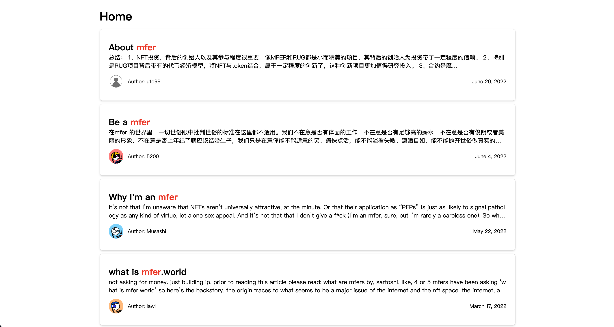

## Building a Decentralized Mirror Search Engine

[Mirror.xyz](https://mirror.xyz/) is an awesome Web3 product for us to write a blog, the website is full of valuable information. When I do token research, finding a good mirror post is always a wonderful read. Then I started building a search engine for it, help me locate information stored on Mirror. Here is how I do it by using [Glitter Protocol](https://glitterprotocol.io/).

### Step 1 - Initialize the Project

First, you need to create a new project and install the Glitter SDK. This SDK allows easy connection to the Glitter network and access to mirror metadata.

``` shell
npm install @glitterprotocol/glitter-sdk
```


### Step 2 - Connect to the Network

Next, generate a client so that the application can interact with the Glitter network. Initialize an LCDClient instance through the Glitter SDK and configure the relevant parameters.


``` js
import { LCDClient, MnemonicKey, Coins, Numeric } from '@glitterprotocol/glitter-sdk';

const XIAN_HOST = "https://api.xian.glitter.link"
const CHAIN_ID = "glitter_12000-2"
const mk = new MnemonicKey({
    mnemonic: "lesson police usual earth embrace someone opera season urban produce jealous canyon shrug usage subject cigar imitate hollow route inhale vocal special sun fuel"
});

const client = new LCDClient({
    URL: XIAN_HOST,
    chainID: CHAIN_ID,
    gasPrices: Coins.fromString('0.15agli'),
    gasAdjustment: Numeric.parse(1.5),
})
const dbClient = client.db(key);
```


### Step 3 - Build the Search Function

The search function is the core of the application. Define a search function that accepts the user's query keywords, constructs a query statement, and sends it to the Glitter network.


``` js
import { MatchPhraseQuery, queryStringPrepare, prepareSQL } from '@glitterprotocol/glitter-sdk';

const queries = [];
const query = 'Come Prima'
queries.push(new MatchPhraseQuery('title', `${query}`));
const queryStr = queryStringPrepare(queries);

const libraryTable = 'index3.mirrorentry';
const libraryColumns = 'title,category,body,_id,author,cover_url,article_link,language,published_time,category,display_name,avatar_url,author_url';

const sql = `select ${libraryColumns} from ${libraryTable} where query_string(?) limit 0, 200`;
const newSql = prepareSQL(sql, queryStr);
const sqlData = await dbClient.query(newSql);
```


### Step 4 - Display the Search Results

After building the search function, you need to display the search results on the front-end interface. This includes designing an interface to show the basic information of mirrors and providing some interactive elements so that users can easily browse and select the mirrors they are interested in.



Through these four steps, we can build a decentralized mirror search engine, providing users with an efficient and convenient platform to retrieve mirror resources.

The entire source code is available [here](https://github.com/glitternetwork/mirror-search-demo).